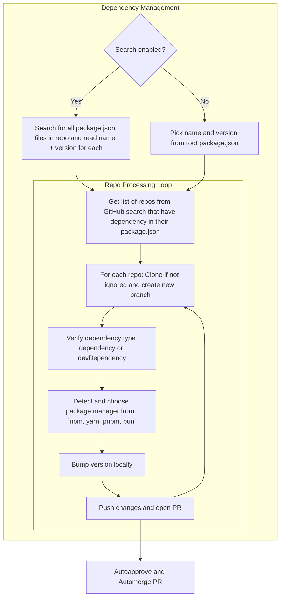

# Organization Projects' Dependency Manager
GitHub Action that handles automated update of dependencies in package.json between projects from the same GitHub organization. You run this workflow after npm package release. It searches for libraries in your GitHub organization that depend on the released packages and creates pull requests with updated dependencies.

While updating multiple repositories, if there are issues with one of them, the action doesn't fail but continues bumping deps in next repo from the list. 

<!-- toc -->

- [Why I Created This Action?](#why-i-created-this-action)
- [How It Works?](#how-it-works)
- [Tests](#tests)
- [Action Flow](#action-flow)
- [Configuration](#configuration)
- [Example](#example)
- [Development](#development)
- [Debug](#debug)

<!-- tocstop -->

## Why I Created This Action?

GitHub Action that handles automated update of dependencies in package.json between projects from the same GitHub organization.

The main goal was to automate bump of dependencies between packages from the same organization. You might have several projects depending on each other, and your option to efficiently work with them should not only be a monorepo. In my opinion, people reach for monorepo to quickly, letting themselves to solve one complex problem by introducing another one. 

You cannot apply monorepo everywhere, sometimes it doesn't make sense, and you still have some dependencies that you need to bump manually. This action doesn't have such a problem.

## How It Works?

tl;dr To find dependent projects, GitHub Search is utilized.

Before you run this action, I suggest you first use manually the search query used by this action. Go to https://github.com and in search box paste `"@myorg/test" user:myorg path:package.json` (with proper names of course). Identify repositories that have your package in dependencies, but you do not want to automatically update it. Add it to the list of ignored repositories

1. You run this action in some repository after releasing a package, let's say `test-packages` in organization `myorg`.
1. If search is set to false (default), only the package.json from the root or from the provided path is processed. If search is set to true, all package.json files are searched using `repo:myorg/test-packages in:file filename:package.json` query and the following processing steps are applied for each of them:
    1. The package name and version are read from the package.json file in which the action is running, let's say `@myorg/test` with version `1.0.1`
    1. The following search is performed `"@myorg/test" user:myorg in:file filename:package.json` (GitHub still uses the Legacy API for search, so `path:` doesn't work, we need to use `filename:` instead)
    1. Search is not perfect, quotations from `"@myorg/test"` are ignored and result can also contain repositories that have only `@myorg/test-sdk` as dependency
    1. All found repositories are cloned (except of `@myorg/test`)
    1. Action verifies if you really have `@myorg/test` in dependencies or devDependencies
    1. Action checks the package.json to see the package manager used (npm, yarn, pnpm or bun) and runs proper install command.
    1. Now the rest, bumping + pushing + creating a pull request

Approach with using GitHub search has only one disadvantage, bumping will not work in forks, as forks do not show up in search results. It is still better than cloning all repositories from your organization.

## Tests

I provided only unit tests for essential utils. There are no integration tests as I have no clear idea of how they would look like and prefer to test manually every change for the time being. I have a [test](https://github.com/lukasz-lab) organization that I test against all cases and am 100% sure all works as expected. Is it lame? :man_shrugging:. I don't see a point to invest time into more sophisticated automated tests if, at the moment, I'm the only one interested in this GitHub Action. I'm happy to work on this. Just report an issue, and if possible, suggest a solution.

## Action Flow



## Configuration

Name | Description | Required | Default
--|------|--|--
github_token | Token to use GitHub API. It must have "repo" scopes so it can push to repos. It cannot be the default GitHub Actions token GITHUB_TOKEN. GitHub Action token's permissions are limited to the repository that contains your workflows. Provide token of the user that has rights to push to the repos that this action is suppose to update.  | true | -
packagejson_path | Paths to package.json file if not located in the root of the project. Provide just the paths without file name. In the format: `./nested/location`. You can provide single or multiple paths separated by commas. | false | `./`
committer_username | The username (not display name) of the committer will be used to commit changes in the workflow file in a specific repository. In the format `web-flow`. | false | `web-flow`
committer_email | The committer's email that will be used in the commit of changes in the workflow file in a specific repository. In the format `noreply@github.com`.| false | `noreply@github.com`
commit_message_prod | It is used as a commit message when bumping dependency from "dependencies" section in package.json. In case dependency is located in both dependencies and devDependencies of dependant, then prod commit message is used. It is also used as a title of the pull request that is created by this action. | false | `fix: update ${dependencyName} to ${dependencyVersion} version`
commit_message_dev | It is used as a commit message when bumping dependency from "devDependencies" section in package.json. It is also used as a title of the pull request that is created by this action. | false | `chore: update ${dependencyName} to ${dependencyVersion} version`
repos_to_ignore | Comma-separated list of repositories that should not get updates from this action. Action already ignores the repo in which the action is triggered so you do not need to add it explicitly. In the format `repo1,repo2`. | false | -
base_branch | Name of the base branch, where changes in package.json must be applied. It is used in PR creation. Branch where changes are introduced is cut from this base branch. If not provided, default branch is used. In the format: `next-major`. | false | -
custom_id | This custom_id is added as a unique identifier value to the PR created by the bot so the bot can later recognize it as created by the bot, so it updates existing PR instead creating new one. If custom_id is not specified, action assumes that you still want bot to create multiple PRs in one repo, with multiple updates. Once you add the custom_id, you enable flow with active one PR per repo | false | -
search | In case you have multiple packages.json files in repository and you want to update by searching for all of them. This is useful for monorepos. **Note: Enabling `search` overrides the list of paths provided.** | false | `false` (only root package.json is updated)
ignore_paths | Comma-separated list of paths to **directories** to ignore when searching for package.json files if `search` is set to true. In the format: `./path/to/ignore,./another/path/to/ignore`. | false | -

## Example

Below you can find full example for this GitHub Action used agains **release** webhook. You can also use it in other events. This action doesn't read events, it just runs when triggered. In only needs access to the `package.json` of the repository in which it is running. This means you can integrate it with other workflows, like your release workflow.

```yml
name: Bump package version in dependent repos

on:
  release:
    types:
      - published

jobs:

  bump:
    runs-on: ubuntu-latest
    steps:
      - uses: actions/checkout@v2
      - name: Bumping
        uses: derberg/npm-dependency-manager-for-your-github-org@v5
        with:
          github_token: ${{ secrets.CUSTOM_TOKEN }}
          repos_to_ignore: repo1,repo2
          base_branch: next-major
          packagejson_path: ./custom/path
          committer_username: pomidor
          committer_email: pomidor@pomidor.com
          #This is commit message and PR title for repos where this package is in dependencies
          commit_message_prod: "fix: update internal production dependencies"
          #This is commit message and PR title for repos where this package is in devDependencies
          commit_message_dev: "chore: update internal development dependencies"
```

### Multiple package.json files

In case you have multiple package.json files in your repository and you want to update them all, you can provide comma-separated list of paths to `packagejson_path` input.

```yml
      - name: Bumping
        uses: derberg/npm-dependency-manager-for-your-github-org@v5
        with:
          github_token: ${{ secrets.CUSTOM_TOKEN }}
          packagejson_path: ./path/one,./path/two,./path/three
```

### Searching for package.json files

In case you have multiple package.json files in your repository and you want to update by searching for all of them, enable `search` input. You can specify ignore paths to exclude certain directories from the search. This is useful for monorepos. Note: Enabling `search` overrides the list of paths provided.

```yml
      - name: Bumping
        uses: derberg/npm-dependency-manager-for-your-github-org@v5
        with:
          github_token: ${{ secrets.CUSTOM_TOKEN }}
          search: true
          ignore_paths: ./path/to/ignore,./another/path/to/ignore
```

## Development

```bash
# GITHUB_TOKEN provide personal GitHub token with scope to push to repos
# GITHUB_REPOSITORY provide name of org/user and the repo in which this workflow is suppose to run
# PACKAGE_JSON_LOC=test is a path to package.json file against you want to test
GITHUB_TOKEN=token PACKAGE_JSON_LOC=test GITHUB_REPOSITORY="lukasz-lab/.github" npm start
```

```bash
# LOCAL_REPO_PATH=../test is the path to be appended to all the searched package.json files in case you want to test multiple package.json files in one repo
GITHUB_TOKEN=token GITHUB_REPOSITORY="lukasz-lab/.github" LOCAL_REPO_PATH=../test SEARCH=true npm start
```

## Debug

In case something ain't right, the action doesn't work as expected, enable debugging. Add to **Secrets** of the repository a secret called `ACTIONS_STEP_DEBUG` with value `true`. Now, once you run the action again, there will be additional logs visible that start with `DEBUG: `.
